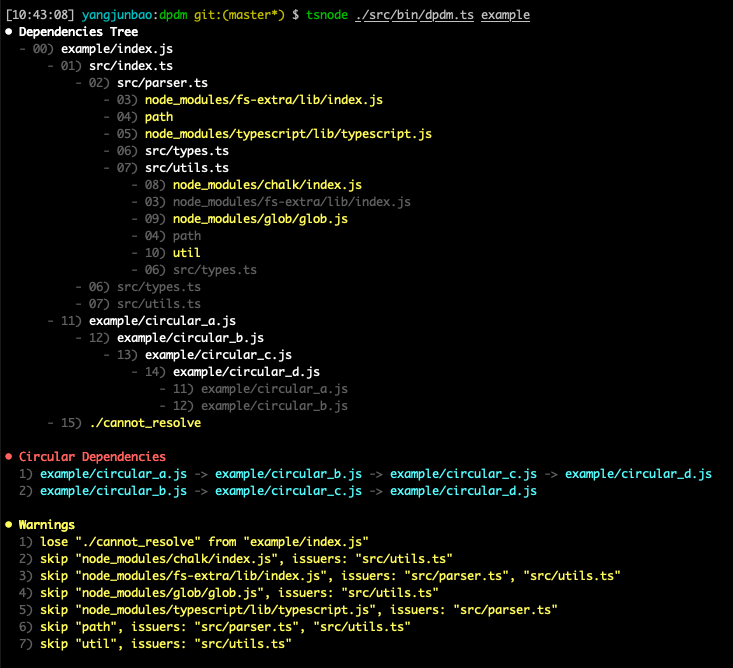

# dpdm

A static dependencies analyzer for CommonJS/ESM.

## Features

- Support `CommonJS` and `ES Module`.
- Support `JavaScript` and `TypeScript` completely.
- Light weight: use TypeScript to parse all modules.
- Fast: use asynchronous API to load modules.
- Stable output: This is compared to madge, whose results are completely inconclusive when analyze `TypeScript`.

## Install

```bash
npm i dpdm # or yarn add dpdm

# use as command line
npm i -g dpdm # or yarn global add dpdm
dpdm --help
```

## Usage

### Library

```typescript jsx
import { parseDependencyTree, parseCircular } from 'dpdm';

const tree = parseDependencyTree('./index', {
  /* options */
});
const circulars = parseCircular(tree);
console.log(circulars);
```

### Command line

```bash
$ dpdm --help

dpdm.ts [<options>] entry...

Options:
  --version            Show version number  [boolean]
  --context            the context directory to shorten path, default is process.cwd()  [string]
  --extensions, --ext  comma separated extensions to resolve  [string] [default: ".js,.jsx,.ts,.tsx,.json"]
  --include            included filenames regexp in string  [string] [default: "\.[tj]sx?$"]
  --exclude            excluded filenames regexp in string  [string] [default: "/node_modules/"]
  --output, -o         output json to file  [string] [default: "dpdm.json"]
  --tree               print tree to stdout  [boolean] [default: true]
  --circular           print circular to stdout  [boolean] [default: true]
  --warning            print warning to stdout  [boolean] [default: true]
  -h, --help           Show help  [boolean]
```

> The result example:
> 

## API

1. `parseDependencyTree(entry, option, output)`: parse dependencies for a single entry

   ```typescript jsx
   export declare function parseDependencyTree(
     entry: string | string[],
     options: ParserOptions,
     output?: DependencyTree,
   ): Promise<DependencyTree>;

   export interface ParseOptions {
     context: string;
     extensions: string[];
     include: RegExp;
     exclude: RegExp;
   }

   export enum DependencyKind {
     CommonJS = 'CommonJS', // require
     StaticImport = 'StaticImport', // import ... from "foo"
     DynamicImport = 'DynamicImport', // import("foo")
     StaticExport = 'StaticExport', // export ... from "foo"
   }

   export interface Dependency {
     issuer: string;
     request: string;
     kind: DependencyKind;
     result: string;
   }

   export type DependencyTree = Record<string, Dependency[]>;
   ```

2. `parseCircular(tree)`: parse circulars in dependency tree

   ```typescript jsx
   export declare function parseCircular(tree: DependencyTree): string[][];
   ```

## TODO

- [ ] Support HTML and HTML like modules
- [ ] Support CSS and CSS like modules
- [ ] Print interactive SVG

## LICENSE

[MIT](./LICENSE)
